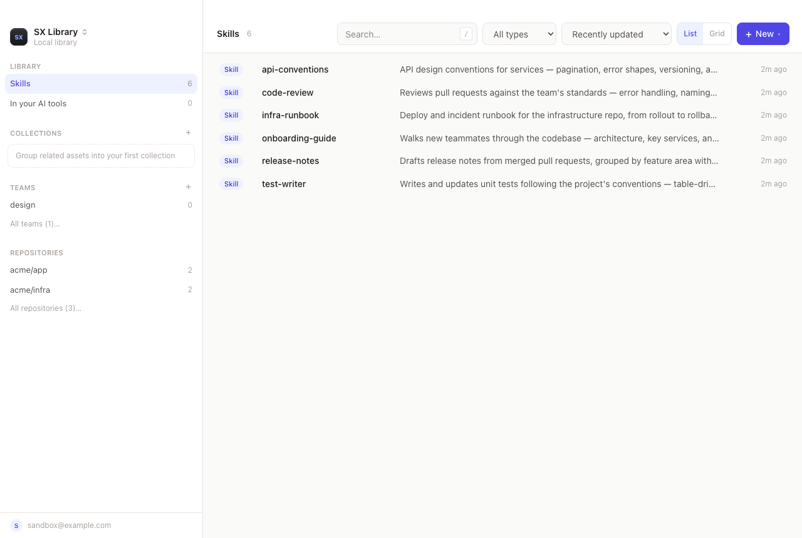

<div align="center">


### Skill sharing made easy
#### Drop a vault in your Dropbox. Your whole team's skills — versioned, in every AI tool.

[](https://github.com/sleuth-io/sx/stargazers)
[](https://star-history.com/#sleuth-io/sx&Date)
[](https://github.com/sleuth-io/sx/releases)
[](https://github.com/sleuth-io/sx/pulls)

⭐ [Star this repo](https://github.com/sleuth-io/sx) · 🌐 [Website](https://skills.new) · 📋 [Changelog](https://github.com/sleuth-io/sx/releases) · 📄 [License](LICENSE)

</div>


## The 30-second version

1. **[Download the app](https://github.com/sleuth-io/sx/releases)** (`sx-app-*` for macOS, Windows, Linux) and open it — it asks one question and sets up your library.
2. **Point it at a folder your team already syncs** — Dropbox, Google Drive, iCloud, OneDrive. That folder *is* the team vault. No server, no git, no accounts.
3. **Drag a skill in.** It's published. Teammates who point at the same folder get it on their machine, in every AI tool they use.

Command-line person? The same thing, three lines (npm-style manifest + lock under the hood):

```bash
brew install sleuth-io/tap/sx
sx init --type path --path ~/Dropbox/sx-vault
sx add ~/.claude/skills/my-skill
```

## Why sx?

AI assets — skills, MCPs, agents, rules, commands, hooks — usually live inside a single Git repo. The moment you want them in another repo you copy-paste, and they drift out of sync with no source of truth. `sx` manages complex sharing and distribution of AI assets for real-world teams:

- **Zero infrastructure** — a folder your team already syncs is a full vault; no server, no accounts
- **No Git knowledge required** — non-technical teammates share skills too; the plumbing stays hidden
- **Every AI tool, including the web ones** — one asset installs into every major AI assistant
- **Share across projects and teams** — manage an asset once, install it into any repo or team
- **The right assets, not all of them** — scope to an org, repo, path, team, bot, or user; no context bloat
- **Grows with you** — versioning, adoption stats (`sx stats`), and an audit trail (`sx audit`) when you need them

## App or command line — your choice

sx has two front doors to the same libraries: a **desktop app** and a **command line**. They share one configuration, so a library added in one shows up in the other — engineers can live in the CLI while everyone else uses the app, and nothing drifts.

**If you're not a command-line person, start with the app.** It covers the whole workflow without a terminal: create and edit skills in a built-in editor (or just drag files in), publish them to your team's library, install them into your AI tools with one click, and organize everything with collections and teams. Technical users can turn on per-library repository views to see exactly which repos each skill is scoped to.

<p align="center"></p>

First launch asks one question — how will you use it? — and sets the library up to match:

<p align="center"></p>

Download the app for macOS, Windows, or Linux from [Releases](https://github.com/sleuth-io/sx/releases) (the `sx-app-*` artifacts). Power users: keep reading for the CLI.

## Quickstart

**Install via Homebrew (macOS/Linux):**

```bash
brew tap sleuth-io/tap
brew install sx
```

**Or via shell script:**

```bash
curl -fsSL https://raw.githubusercontent.com/sleuth-io/sx/main/install.sh | bash
```

Then initialize in your vault or project:

```bash
sx init
```

From here: **add** skills, **share** them with the right people, and **see** what's used.


### Manage — capture, version, and observe

Add assets to your vault (`sx` auto-detects the type):

```bash
sx add /path/to/my-skill
sx add ~/.claude/skills/my-skill            # an existing Claude Code skill
sx add code-review@claude-plugins-official  # a plugin from a registry
```

Your AI assets stay exactly as they are — `sx` just wraps them with metadata for versioning and stores them in its vault format.

**Multiple vaults?** Use profiles to switch between them:

```bash
sx profile add work        # Add a new profile
sx profile use work        # Switch to it
sx profile list            # See all profiles
```

**See what's actually used** — track adoption and token usage across your team:

```bash
sx stats                   # adoption dashboard
sx stats --since 7d --json # machine-readable
```

### Distribute — install to the right scope, on any client

```bash
# Install everything scoped to you, into the current project
sx install
```

**Install targets** — pick who sees which asset:

```bash
sx install my-skill --org                               # everyone in the vault
sx install my-skill --repo github.com/acme/infra        # only inside that repo
sx install my-skill --path github.com/acme/infra#docs/  # one path in a repo
sx install my-skill --team platform                     # every member of a team
sx install my-skill --user alice@acme.com               # a single user
sx install my-skill --bot python-backend                # a bot identity (CI runner, agent)
```

See [docs/scoping.md](docs/scoping.md) for the full overview and
links to a per-scope doc for each install target.

**Use your vault from claude.ai or chatgpt.com** — expose it as an MCP
endpoint via the skills.new relay:

```bash
sx cloud connect       # opens skills.new, paste back the attach line
sx cloud serve         # keep this running — Ctrl+C exits
sx cloud status        # prints the MCP URL to paste into claude.ai / chatgpt.com
```

The relay forwards requests over a WebSocket — vault
content stays local. See [docs/cloud-relay.md](docs/cloud-relay.md).

### Govern — audit and migrate

**Audit** — every team and install mutation is recorded:

```bash
sx audit                                   # recent team/install mutations
sx audit --actor alice@acme.com --since 30d --event install.set
```

**Migrate a whole vault** (assets + versions, teams, bots, scopes, audit, usage):

```bash
sx vault copy --from skills-new --to git-vault   # preview (read-only)
sx vault copy --from skills-new --to git-vault --yes
```

See [docs/copy.md](docs/copy.md) for directionality and what's lossy. A gated change-request flow (RBAC) is on the [roadmap](#roadmap).

## What can you build and share?

- **Skills** - Custom prompts and behaviors for specific tasks
- **Rules** - Coding standards and guidelines that apply to specific file types or paths
- **Agents** - Autonomous AI agents with specific goals
- **Commands** - Slash commands for quick actions
- **Hooks** - Automation triggers for lifecycle events
- **MCP Servers** (experimental) - Model Context Protocol (MCP) servers for external integrations
- **Plugins** - Claude Code plugin bundles with commands, skills, and more

## Portable agents, not just files

An AI agent is only as good as what it knows and what it's allowed to do. `sx` lets you describe that **once** — define a Bot and attach the agent's prompt plus the skills, rules, commands, hooks, and MCP servers it depends on — and install it unchanged across any client, coding or not.

- **One definition, every tool** — the same agent runs unchanged on every [supported client](#supported-clients), coding or not; `sx` writes each one's native format on install
- **Bundle the whole capability** — skills, rules, commands, hooks, and MCP config travel together as versioned assets, not loose files scattered across repos and machines
- **Decoupled from any one vendor** — AI tools are commoditizing; the agents running on them shouldn't be locked in. Describe them in a portable format you own and carry them between tools as the landscape shifts

## Distribution models

Choose the right distribution model for your team:

### Shared folder (Small teams, zero infrastructure)

Put the vault in a folder your team already syncs — Dropbox, Google Drive,
OneDrive, or iCloud. No git, no GitHub account, no server. See
[docs/synced-folders.md](docs/synced-folders.md).

```bash
sx init --type path --path ~/Dropbox/sx-vault
```

### Local (Personal)

Perfect for easily sharing personal tools across multiple personal projects

```bash
sx init --type path --path my/vault/path
```

### Git vault (Small teams)

Share assets through a shared git vault

```bash
sx init --type git --repo-url git@github.com:yourteam/skills.git
```

### Skills.new (Large teams and enterprise)

Centralized management with a UI for discovery, creation, sharing, and usage analytics

```bash
sx init --type sleuth
```

### Plugin marketplace (no sx required)

Every git or path vault is also a **Claude Code / Codex plugin
marketplace** — sx generates and maintains `.claude-plugin/marketplace.json`
and `.codex-plugin/plugin.json` on every publish. Teammates who don't run
sx can install the library's skills directly from their AI tool:

```
# Claude Code
/plugin marketplace add yourteam/skills
/plugin install skills@skills

# Codex
codex plugin marketplace add git@github.com:yourteam/skills.git
```

Each collection in the vault is also exposed as its own Claude Code
plugin, so people can install just the slice they need. Private repos
work through normal git credentials. Plugin installs deliver skills only
(rules and per-team scoping still need `sx install`) — see
[docs/plugins-spec.md](docs/plugins-spec.md).

## How it works

sx follows the manifest-and-lock pattern used by npm, cargo, and uv:

1. **Manifest (`sx.toml`)** — the vault's source of truth. Lists every
   managed asset, its install scopes (`org`, `repo`, `path`, `team`,
   `bot`, `user`), and team definitions (members, admins, repositories).
   Committed to git / path vaults. See [docs/manifest-spec.md](docs/manifest-spec.md).
2. **Lock file** — a per-user resolved artifact. `sx install` reads the
   manifest, resolves team and user scopes against the caller's git
   identity, and writes the result to the user's cache directory
   (`~/<cache>/sx/lockfiles/`). When the resolved lock changes, the
   previous file is rotated with a timestamp so old installs stay
   reproducible.
3. **Audit + usage streams** — every team/install mutation appends an
   audit entry to `.sx/audit/YYYY-MM.jsonl`; usage events append to
   `.sx/usage/YYYY-MM.jsonl`. Query them with `sx audit` / `sx stats`.

High level: **manage** assets in one vault, **distribute** them
[globally, per repo, per path, per team, per bot, or per user](docs/scoping.md) —
auto-installing on new Claude Code sessions so everyone stays in sync — and
**govern** every change through the audit and usage streams.

## Use sx as a Go library

Everything the CLI does to a vault is also a package. Publish skills and
agents, manage bots and teams, and browse or download assets from your own
program against Skills.new, Git, or local Path vaults through one `Client`:

```go
import "github.com/sleuth-io/sx/pkg/sxvault"

ctx := context.Background()
client, err := sxvault.OpenSkillsNew("https://app.skills.new", token)
if err != nil {
    log.Fatal(err)
}
if err := client.PutSkillZip(ctx, sxvault.SkillZipSpec{
    Name: "lint-helper", Version: "1.0.0", ZipData: zip,
}); err != nil {
    log.Fatal(err)
}
```

See [docs/library.md](docs/library.md) for the full API guide.

## Supported Clients

| Client                  | Status         | Notes                                                     |
|-------------------------|----------------|-----------------------------------------------------------|
| Claude Code             | ✅ Supported   | Full support for all asset types                          |
| Cline                   | ✅ Supported   | Skills, rules, workflows as commands, MCP servers, hooks  |
| Codex                   | ✅ Supported   | Skills, commands, agents, MCP servers                     |
| Cursor                  | ✅ Supported   | Skills, rules, commands, MCP servers, hooks               |
| GitHub Copilot          | ✅ Supported   | Skills, rules, commands, agents, MCP servers, local hooks |
| Gemini (CLI/VS Code)    | ✅ Supported   | Skills, rules, commands, MCP servers, hooks               |
| Gemini (JetBrains)      | ✅ Supported   | Rules, MCP servers only (no commands/hooks)               |
| Gemini (Android Studio) | ✅ Supported   | Rules, MCP-remote only (HTTP, no stdio)                   |
| Kiro                    | ✅ Supported   | Skills, rules, commands, MCP servers                      |
| Openclaw                | ✅ Supported   | Skills, rules, commands                                   |
| OpenCode                | ✅ Supported   | Skills, commands, agents, rules, MCP servers              |
| claude.ai (web)         | ✅ Supported   | Via the [skills.new cloud relay](docs/cloud-relay.md)     |
| chatgpt.com (web)       | ✅ Supported   | Via the [skills.new cloud relay](docs/cloud-relay.md)     |


## Roadmap
- ✅ Local, Git, and Skills.new vaults
- ✅ Claude Code support
- ✅ Cline support
- ✅ Cursor support
- ✅ GitHub Copilot support
- ✅ Gemini support
- ✅ Codex support
- ✅ Kiro support
- ✅ Openclaw support
- ✅ OpenCode support
- ✅ claude.ai and chatgpt.com support via the skills.new cloud relay
- ✅ Org, Team, Bot, Repository & Personal installation targets for all vault types
- ✅ Skill discovery - Use Skills.new to discover relevant skills from your code and architecture
- ✅ Analytics - Track skill usage and impact
- **RBAC and change request flow** - Support a gated skill update flow

## License

See LICENSE file for details.

---

## Development

<details>
<summary>Click to expand development instructions</summary>

### Documentation

- [Vault Spec](docs/vault-spec.md) - Vault directory structure
- [Manifest Spec](docs/manifest-spec.md) - sx.toml source-of-truth format (assets, scopes, teams)
- [Lock Spec](docs/lock-spec.md) - Per-user resolved lock file
- [Scoping](docs/scoping.md) - Install targets and links to per-scope docs (orgs, repos, teams, users, bots)
- [Vault copy](docs/copy.md) - `sx vault copy` cross-vault migration (assets, teams, bots, scopes, audit, usage)
- [Audit log](docs/audit.md) - Event catalog, `sx audit` filters, storage format
- [Usage analytics](docs/stats.md) - `sx stats` dashboard, JSON output, event format
- [Metadata Spec](docs/metadata-spec.md) - Asset metadata format
- [MCP Spec](docs/mcp-spec.md) - MCP server and query tool
- [Profiles](docs/profiles.md) - Multiple configuration profiles
- [Clients](docs/clients.md) - Client support model and IDE vs CLI limitations
- [Cloud relay](docs/cloud-relay.md) - Expose your vault to claude.ai and chatgpt.com via skills.new
- [Library](docs/library.md) - Use sx as a Go library via the `pkg/sxvault` public API


### Prerequisites

Go 1.25 or later is required. Install using [gvm](https://github.com/moovweb/gvm):

```bash
# Install gvm
bash < <(curl -s -S -L https://raw.githubusercontent.com/moovweb/gvm/master/binscripts/gvm-installer)

# Install Go (use go1.4 as bootstrap if needed)
gvm install go1.4 -B
gvm use go1.4
export GOROOT_BOOTSTRAP=$GOROOT
gvm install go1.25
gvm use go1.25 --default
```

### Building from Source

```bash
make init           # First time setup (install tools, download deps)
make build          # Build binary
make install        # Install to GOPATH/bin
```

### Testing

```bash
make test           # Run tests with race detection
make format         # Format code with gofmt
make lint           # Run golangci-lint
make prepush        # Run before pushing (format, lint, test, build)
```

### Releases

Tag and push to trigger automated release via GoReleaser:

```bash
git tag v0.1.0
git push origin v0.1.0
```

</details>
