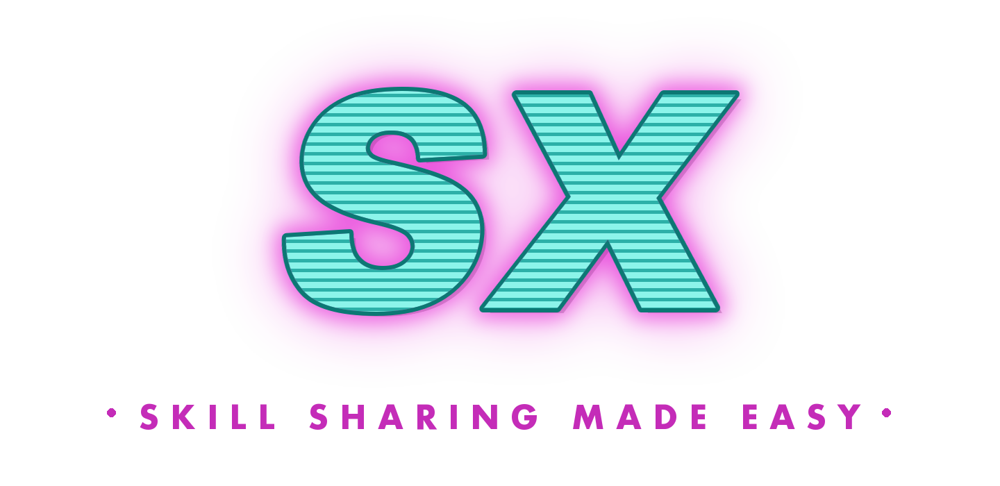

<div align="center">

<br>

### `sx` is your team's private npm for AI assets - skills, MCP configs, commands, and more. 
### Capture what your best AI users have learned and spread it to everyone automatically.
<br>

[](https://github.com/sleuth-io/sx/stargazers)
[](https://star-history.com/#sleuth-io/sx&Date)
[](https://github.com/sleuth-io/sx/releases)
[](https://github.com/sleuth-io/sx/pulls)

⭐ [Star this repo](https://github.com/sleuth-io/sx) · 🌐 [Website](https://skills.new) · 📋 [Changelog](https://github.com/sleuth-io/sx/releases) · 📄 [License](LICENSE)

<br>

</div>


## Why sx?

Your best developers have figured out how to make AI assistants incredibly productive - custom skills, MCP configs, slash commands, proven patterns. But that knowledge is stuck on their machines.

**Current workarounds don't scale:**
- **Copy into each repo** - Duplication nightmare, no central updates, version drift
- **Global config** - Bloats context for projects/tasks that don't need those skills
- **Client plugins** - Manually install each one, locked to one AI client, no bundling

**sx solves this by:**
- **Sharing expertise** - Turn individual discoveries into team assets
- **Instant onboarding** - New devs inherit the team's AI playbook on day one
- **Central updates** - Change once in your vault, everyone gets the update
- **Scoped installation** - Right assets for each repo, no context bloat
- **Works with any AI client** - Claude Code, Cursor, GitHub Copilot, Gemini, Kiro, and more, plus claude.ai and chatgpt.com via the cloud relay

## Quickstart

**Install via Homebrew (macOS/Linux):**

```bash
brew tap sleuth-io/tap
brew install sx
```

**Or via shell script:**

```bash
curl -fsSL https://raw.githubusercontent.com/sleuth-io/sx/main/install.sh | bash
```

Then

```bash
# Initialize
sx init

# Add an asset from your vault
sx add /path/to/my-skill

# Install assets to your current project
sx install
```

**Multiple vaults?** Use profiles to switch between them:

```bash
sx profile add work        # Add a new profile
sx profile use work        # Switch to it
sx profile list            # See all profiles
```

**Targeted installs** — pick who sees which asset:

```bash
sx install my-skill --org                         # everyone in the vault
sx install my-skill --repo github.com/acme/infra  # only installs when run in that repo
sx install my-skill --path github.com/acme/infra#docs/  # only for a path in a repo
sx install my-skill --team platform               # everyone on a team
sx install my-skill --user alice@acme.com         # a single user (must be the caller)
```

**Preview** — see what `sx install` would resolve for you, the `pip
freeze` analogue, without downloading or writing anything:

```bash
sx install --dry-run
```

**Teams** (git + path vaults):

```bash
sx team create platform --member alice@acme.com --admin alice@acme.com \
                        --repo github.com/acme/infra
sx team member add platform bob@acme.com
sx team admin set platform bob@acme.com       # promote bob
sx team repo add platform github.com/acme/tools
sx team show platform
sx team list
sx team delete platform --yes
```

Teams have at least one admin at all times; mutations that would leave a
team admin-less are rejected. User-scoped installs can only target the
caller (prevents write-access holders from silently promoting an asset
for teammates).

**Use your vault from claude.ai or chatgpt.com** — expose it as an MCP
endpoint via the skills.new relay:

```bash
sx cloud connect       # opens skills.new, paste back the attach line
sx cloud serve         # keep this running — Ctrl+C exits
sx cloud status        # prints the MCP URL to paste into claude.ai / chatgpt.com
```

The relay forwards requests over a WebSocket your machine opens — vault
content stays local. See [docs/cloud-relay.md](docs/cloud-relay.md).

**Usage analytics & audit**:

```bash
sx stats                                   # adoption dashboard
sx stats --since 7d --json                 # machine-readable
sx audit                                   # recent team/install mutations
sx audit --actor alice@acme.com --since 30d --event install.set
```

### Already using Claude Code?

If you've built up skills, plugins, or MCP configs in your `.claude` directory, `sx` helps you version, sync across machines, and share with teammates.

```bash
# Add your existing skills/commands (sx auto-detects the type)
sx add ~/.claude/commands/my-command
sx add ~/.claude/skills/my-skill
sx add code-review@claude-plugins-official
```

Your prompt files stay exactly as they are - `sx` just wraps them with metadata for versioning.

## What can you build and share?

- **Skills** - Custom prompts and behaviors for specific tasks
- **Rules** - Coding standards and guidelines that apply to specific file types or paths
- **Agents** - Autonomous AI agents with specific goals
- **Commands** - Slash commands for quick actions
- **Hooks** - Automation triggers for lifecycle events
- **MCP Servers** (experimental) - Model Context Protocol (MCP) servers for external integrations
- **Plugins** - Claude Code plugin bundles with commands, skills, and more

## skills.sh support

sx integrates with [skills.sh](https://skills.sh), a community directory of 85k+ agent skills.

```bash
sx add anthropics/skills/frontend-design  # Add a specific skill
sx add vercel-labs/agent-skills           # Browse skills in a repo
sx add --browse                           # Search and browse the full directory
```

## Distribution models

Choose the right distribution model for your team:

### Local (Personal)

Perfect for easily sharing personal tools across multiple personal projects

```bash
sx init --type path --path my/vault/path
```

### Git vault (Small teams)

Share assets through a shared git vault

```bash
sx init --type git --repo git@github.com:yourteam/skills.git
```

### Skills.new (Large teams and enterprise)

Centralized management with a UI for discovery, creation, sharing, and usage analytics

```bash
sx init --type sleuth
```

## How it works

sx follows the manifest-and-lock pattern used by npm, cargo, and uv:

1. **Manifest (`sx.toml`)** — the vault's source of truth. Lists every
   managed asset, its install scopes (`org`, `repo`, `path`, `team`,
   `user`), and team definitions (members, admins, repositories).
   Committed to git / path vaults. See [docs/manifest-spec.md](docs/manifest-spec.md).
2. **Lock file** — a per-user resolved artifact. `sx install` reads the
   manifest, resolves team and user scopes against the caller's git
   identity, and writes the result to the user's cache directory
   (`~/<cache>/sx/lockfiles/`). When the resolved lock changes, the
   previous file is rotated with a timestamp so old installs stay
   reproducible.
3. **Audit + usage streams** — every team/install mutation appends an
   audit entry to `.sx/audit/YYYY-MM.jsonl`; usage events append to
   `.sx/usage/YYYY-MM.jsonl`. Query them with `sx audit` / `sx stats`.

High level: **create** assets with metadata, **share** to your vault,
**install** [globally, per project, per path, per team, or per user](docs/scoping.md),
**auto-install** on new Claude Code sessions, **stay synchronized** —
everyone gets the same tools automatically.

## Supported Clients

| Client                  | Status         | Notes                                                     |
|-------------------------|----------------|-----------------------------------------------------------|
| Claude Code             | ✅ Supported   | Full support for all asset types                          |
| Cline                   | ✅ Supported   | Skills, rules, workflows as commands, MCP servers, hooks  |
| Codex                   | ✅ Supported   | Skills, commands, MCP servers                             |
| Cursor                  | ✅ Supported   | Skills, rules, commands, MCP servers, hooks               |
| GitHub Copilot          | ✅ Supported   | Skills, rules, commands, agents, MCP servers, local hooks |
| Gemini (CLI/VS Code)    | ✅ Supported   | Skills, rules, commands, MCP servers, hooks               |
| Gemini (JetBrains)      | ✅ Supported   | Rules, MCP servers only (no commands/hooks)               |
| Gemini (Android Studio) | ✅ Supported   | Rules, MCP-remote only (HTTP, no stdio)                   |
| Kiro                    | ✅ Supported   | Skills, rules, commands, MCP servers                      |
| claude.ai (web)         | ✅ Supported   | Via the [skills.new cloud relay](docs/cloud-relay.md)     |
| chatgpt.com (web)       | ✅ Supported   | Via the [skills.new cloud relay](docs/cloud-relay.md)     |


## Roadmap
- ✅ Local, Git, and Skills.new vaults
- ✅ Claude Code support
- ✅ Cline support
- ✅ Cursor support
- ✅ GitHub Copilot support
- ✅ Gemini support
- ✅ Codex support
- ✅ Kiro support
- ✅ claude.ai and chatgpt.com support via the skills.new cloud relay
- ✅ Skill discovery - Use Skills.new to discover relevant skills from your code and architecture
- **Analytics** - Track skill usage and impact

## License

See LICENSE file for details.

---

## Development

<details>
<summary>Click to expand development instructions</summary>

### Documentation

- [Vault Spec](docs/vault-spec.md) - Vault directory structure
- [Manifest Spec](docs/manifest-spec.md) - sx.toml source-of-truth format (assets, scopes, teams)
- [Lock Spec](docs/lock-spec.md) - Per-user resolved lock file
- [Teams & targeted installs](docs/teams.md) - Team CRUD, per-team/user/repo installs, dry-run preview
- [Audit log](docs/audit.md) - Event catalog, `sx audit` filters, storage format
- [Usage analytics](docs/stats.md) - `sx stats` dashboard, JSON output, event format
- [Scoping](docs/scoping.md) - Controlling where assets are installed
- [Metadata Spec](docs/metadata-spec.md) - Asset metadata format
- [MCP Spec](docs/mcp-spec.md) - MCP server and query tool
- [Profiles](docs/profiles.md) - Multiple configuration profiles
- [Clients](docs/clients.md) - Client support model and IDE vs CLI limitations
- [Cloud relay](docs/cloud-relay.md) - Expose your vault to claude.ai and chatgpt.com via skills.new


### Prerequisites

Go 1.25 or later is required. Install using [gvm](https://github.com/moovweb/gvm):

```bash
# Install gvm
bash < <(curl -s -S -L https://raw.githubusercontent.com/moovweb/gvm/master/binscripts/gvm-installer)

# Install Go (use go1.4 as bootstrap if needed)
gvm install go1.4 -B
gvm use go1.4
export GOROOT_BOOTSTRAP=$GOROOT
gvm install go1.25
gvm use go1.25 --default
```

### Building from Source

```bash
make init           # First time setup (install tools, download deps)
make build          # Build binary
make install        # Install to GOPATH/bin
```

### Testing

```bash
make test           # Run tests with race detection
make format         # Format code with gofmt
make lint           # Run golangci-lint
make prepush        # Run before pushing (format, lint, test, build)
```

### Releases

Tag and push to trigger automated release via GoReleaser:

```bash
git tag v0.1.0
git push origin v0.1.0
```

</details>
